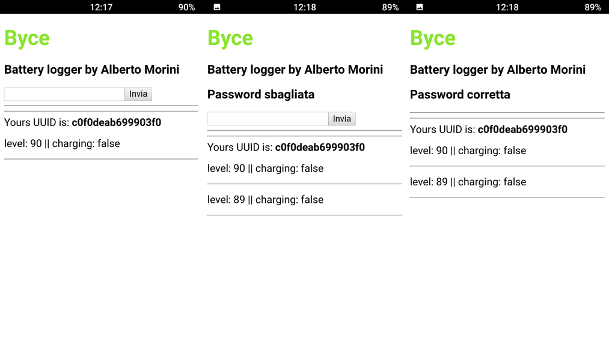
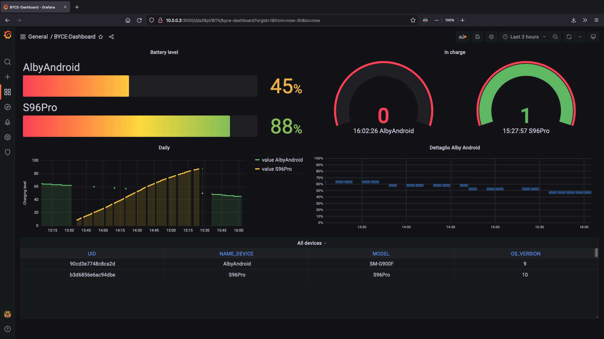
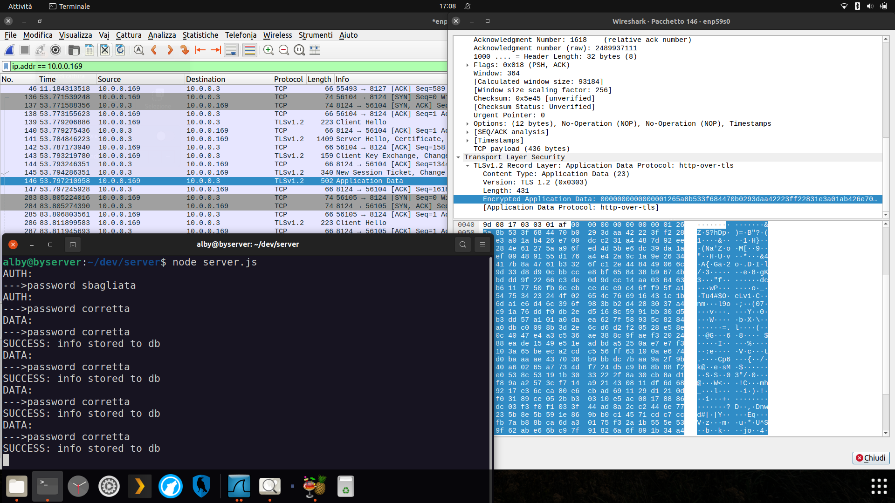

# Byce, a battery logger.

Byce is my experimental thesis for my Bachelor Degree at University of Udin.
This project provide a platform to monitor the battery level of Androids devices connected to a network.


## Architecture

This solution is made by two submodules: the app mobile and the server.
The mobile app will retrieve the related info, and next share the data with the server(.js) via HTTPS messages.
On the server side we can find 'server.js' which is the code developed thus to receive data and store it into a database; an other function is the authentication of the devices which sees the server checks the password provided in each https message with an existing one (created by the end-user on the first start up).

Actually, Byce works on a LAN (Local Area Network), isn't hosted on a public server.

### Development
The mobile app is created with <a href="https://cordova.apache.org/">Apache Cordova</a>, a JavaScript framework that allows to build mobile apps for Android and iOS.

The mobile app

> Has been created just an apk for Android, iOS will follows in future.

Server's code is made with JavaScript and executed by <a href="https://nodejs.org/en/">NodeJS</a>, but, isn't the only technology! There are other self-hosted software used to provide a full solution, in order:

1. <a href="https://www.mysql.com/">MySQL</a> for create the database

2. <a href="https://grafana.com/grafana/">Grafana Visualisation</a> used to create the infographics of data retrieved.


> A screenshot of the Grafana's dashboard (there's the configuration file of it -> server/grafana_export.json)

### Database
Two tables: 'DEVICES' storing the information about the devices and 'DATALOG' containing the data retrieved by smartphones or tablet.
> There's a file with all the database query used: db/table creation and grafana query -> server/byce_DB_QueryGrafana.sql

```sql
CREATE TABLE DEVICES(
    UID VARCHAR(128) PRIMARY KEY,
    NAME_DEVICE VARCHAR(128),
    MODEL VARCHAR(128),
    OS_VERSION VARCHAR(128)
);

CREATE TABLE DATALOG(
    UID VARCHAR(128) NOT NULL,
    LOG_DATE DATE NOT NULL,
    LOG_TIME TIME NOT NULL,
    BAT_LEVEL INTEGER NOT NULL,
    IN_CHARGE BOOLEAN NOT NULL,
    PRIMARY KEY (UID, LOG_DATE, LOG_TIME, IN_CHARGE),
    FOREIGN KEY(UID) REFERENCES DEVICES(UID)
);
```

## Cybersecurity
Data received by server must belongs to devices known by the end-user, so every message have to be authenticated with a password.
If the password is correct, server will send a message with a boolean value used by the app to give a feedback to the user (and hide the input field).
The password picked by the user on the first start-up is hashed via MD5 and stored into a file.

*There are two version of the app, one is the previous version which hasn't any measurement of cybersecurity and use HTTP protocol, the second one is the final version with HTTPS.*

Here a screenshot of an encrypted packet analysed with Wireshark:

